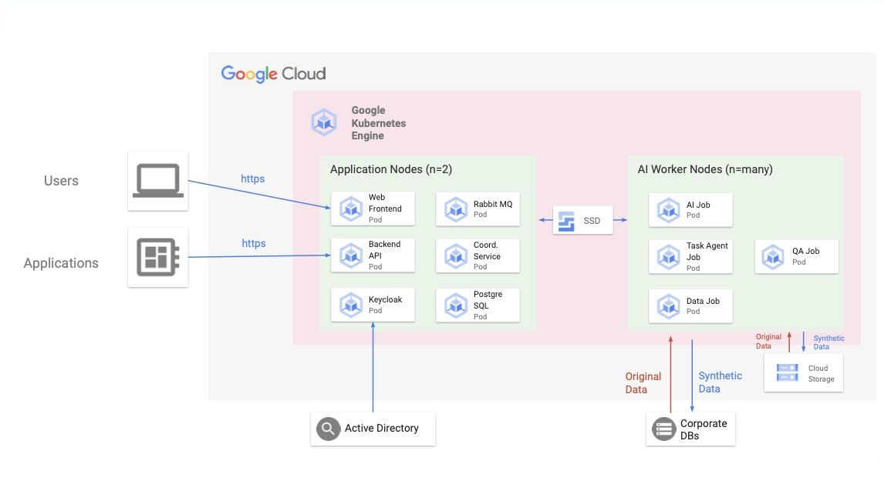

# Overview

With MOSTLY AI Platform, you can generate synthetic data that is highly accurate, protects the private information of your data subjects, and retains the statistical characteristics of your original data.

[Learn more](hhttps://mostly.ai/docs/get-started/).

## Architecture



MOSTLY AI runs as a set of containerized applications and services that you can deploy in a Kubernetes cluster and maintain a fault-tolerant and highly available application.


## Application Nodes

|                     | Pod and image name                           | Description                                                                                                                                                  | Pod Lifecycle |
| ------------------- | -------------------------------------------- | ------------------------------------------------------------------------------------------------------------------------------------------------------------ | ------------- |
| Web frontend        | mostly-ui `mostly-app-ui`                    | Contains the frontend of MOSTLY AI. Reachable over port 8080.                                                                                                | Service       |
| Backend             | mostly-app `mostly-app-enterprise`           | Contains the backend and public APIs of MOSTLY AI.                                                                                                           | Service       |
| Coordinator Service | mostly-coordinator `mostly-coordinator`      | Component that takes all requests from the web application and coordinates execution of tasks on the main AI engine.                                         | Service       |
| Data                | mostly-data `mostly-data`                    | Component that reads metadata and analyzes data sources and destinations.                                                                                    | Service       |
| Keycloak            | mostly-keycloak `mostly-keycloak`            | Keycloak is an open-source identity management, authentication, and authorization tool. This container has a pre-configured Keycloak instance for MOSTLY AI. | Service       |
| PostgreSQL          | mostly-psql `postgres`                       | Database instance of the system. Contains databases for app, coordinator, and Keycloak.                                                                      | Service       |
| Rabbit MQ           | mostly-rabbitmq `rabbitmq`                   | Message queue handling communications between the AI engine and the application.                                                                             | Service       |


## AI Worker nodes

|                | Pod and image name                            | Description                                                                                                                           | Pod Lifecycle |
| -------------- | --------------------------------------------- | ------------------------------------------------------------------------------------------------------------------------------------- | ------------- |
| Task agent job | agent‑<task‑id> `mostly-agent`           | Job that runs the steps to synthesize data.                                                                                           | Job           |
| Data job       | engine‑step‑<step‑id> `mostly-data`      | Component that reads from data sources and writes into data destinations.                                                             | Job           |
| AI job         | engine-step-<step-id> `mostly-engine-v2` | The main engine component, which does the AI training and data generation.                                                            | Job           |
| QA job         | engine-step-<step-id> `mostly-qa`        | Engine component, which creates the Quality Assurance report for privacy and accuracy of the generated data versus the original data. | Job           |


# Installation

## Quick install with Google Cloud Marketplace

Get up and running with a few clicks! Install this mostly-ai app to a Google Kubernetes Engine (GKE) cluster using Google Cloud Marketplace. Follow the [on-screen instructions](https://console.cloud.google.com/marketplace/details/google/mostly-ai).

## Command line instructions

You can use [Google Cloud Shell](https://cloud.google.com/shell/) or a local workstation to complete the steps below.

[](https://console.cloud.google.com/cloudshell/editor?cloudshell_git_repo=https://github.com/GoogleCloudPlatform/click-to-deploy&cloudshell_open_in_editor=README.md&cloudshell_working_dir=k8s/mostly-ai)

### Prerequisites

#### Set up command-line tools

You'll need the following tools in your development environment. If you are using Cloud Shell, `gcloud`, `kubectl`, Docker and Git are installed in your environment by default.

-   [gcloud](https://cloud.google.com/sdk/gcloud/)
-   [kubectl](https://kubernetes.io/docs/reference/kubectl/overview/)
-   [docker](https://docs.docker.com/install/)
-   [git](https://git-scm.com/book/en/v2/Getting-Started-Installing-Git)
-   [cqlsh](https://pypi.org/project/cqlsh/)
-   [helm](https://helm.sh/)
-   [envsubst](https://command-not-found.com/envsubst)

Configure `gcloud` as a Docker credential helper:

```shell
gcloud auth configure-docker
```

#### Enable the required APIs

Enable the Artifact Registry and Google Kubernetes Engine APIs:
[Enable the APIs](https://console.cloud.google.com/flows/enableapi?apiid=artifactregistry.googleapis.com%2Ccontainer.googleapis.com&authuser=1&_ga=2.229255516.1369835223.1695631708-694415933.1692730320)

Enable the Cloud Filestore API and the Google Kubernetes Engine API.
[Enable the APIs](https://console.cloud.google.com/flows/enableapi?apiid=container.googleapis.com,file.googleapis.com&_ga=2.229141596.1369835223.1695631708-694415933.1692730320)

#### Create a new Google Kubernetes Engine cluster from the command line:

Note that we will create the cluster in Frankfurt region `europe-west3-a` with initially 2 nodes of type `c2d-highcpu-8` which is a compute-optimized machine family that has 8 vCPUs and 8GB memory per node. We need at least two nodes to afford the application workloads. However, this can be managed via the gcloud command reference in [this link](https://cloud.google.com/sdk/gcloud/reference/container/clusters/create#--num-nodes).

Besides, another node pool will be needed for the Kubernetes worker jobs, it's recommended that each node should have 16 vCPUs and 32GB memory, so the `c2d-highcpu-16` node type will be used. This node will have a desired/minimum size of 2 nodes, and a maximum of 10, with nodes auto-scaler enabled. The `mostly_worker=yes` label has also to be added for worker jobs to start properly.

```shell
# Set the below environment variables
export CLUSTER=mostly-ai-cluster
export ZONE=europe-west3-a
export DEFAULT_NODE_TYPE=c2d-highcpu-8
export DEFAULT_NODE_COUNT=2
export WORKER_NODE_TYPE=c2d-highcpu-16
export WORKER_NODE_COUNT=2
export WORKER_NODE_MAX_COUNT=10

# Provision the GKE cluster
gcloud container clusters create "$CLUSTER" \
--machine-type="$DEFAULT_NODE_TYPE" \
--num-nodes="$DEFAULT_NODE_COUNT" \
--addons=GcpFilestoreCsiDriver \
--autoprovisioning-network-tags=healthcheck \
--zone "$ZONE"

# Create a new node pool for wroker K8s jobs
gcloud container node-pools create \
workers-node-pool --cluster="$CLUSTER" \
--machine-type="$WORKER_NODE_TYPE" --enable-autoscaling \
--num-nodes="$WORKER_NODE_COUNT" --min-nodes="$WORKER_NODE_COUNT" --max-nodes="$WORKER_NODE_MAX_COUNT" \
--node-labels=mostly_worker=yes --zone "$ZONE"
```


#### Create a new firewall rule to allow the traffic from a couple of GCP IP ranges specified as health checks sources as in the below command.

Note that the node network tag `healthcheck` that was used in the above `cluster create` command MUST match the one in the firewall rule below.

```shell
gcloud compute firewall-rules create fw-allow-health-check-and-proxy \
   --network=default \
   --action=allow \
   --direction=ingress \
   --target-tags=healthcheck \
   --source-ranges=130.211.0.0/22,35.191.0.0/16 \
   --rules=tcp:9376
```

#### Configure `kubectl` to connect to the new cluster from your computer:

```shell
gcloud container clusters get-credentials "$CLUSTER" --zone "$ZONE"
```

#### Clone this repo

Clone this repo and the associated tools repo.

```shell
git clone --recursive https://github.com/mostly-ai/gcp-marketplace.git
```

#### Install the application resource definition

An Application resource is a collection of individual Kubernetes components, such as Services, Deployments, and so on, that you can manage as a group.

To set up your cluster to understand Application resources, run the following command:

```shell
kubectl apply -f "https://raw.githubusercontent.com/GoogleCloudPlatform/marketplace-k8s-app-tools/master/crd/app-crd.yaml"
```

You need to run this command once.

The Application resource is defined by the [Kubernetes SIG-apps](https://github.com/kubernetes/community/tree/master/sig-apps) community. The source code can be found on [github.com/kubernetes-sigs/application](https://github.com/kubernetes-sigs/application).

---

### Install the Application

#### Configure the app with environment variables

**Configure the container images:**

Mostly AI Helm Chart has many components, each one has its own Docker image. Therefore, you have to update the image tags according to the release that you wish to deploy.

For example: for the `v113` release, the below image tags will be used:

```shell
export APP_TAG=1.113
export UI_TAG=1.113
export UI_DOCS_TAG=1.113
export DATA_TAG=1.113
export COORDINATOR_TAG=1.113
export KEYCLOAK_TAG=1.113
```

**Configure other application variables**:

Below are some other essential variables that need to be set before installing the Helm Chart:

```shell
export CHART_NAME=mostly-ai
export NAMESPACE=mostlyai
export DOMAIN_NAME=mostly.mycompany.com
```

#### Expand the manifest template

Use `helm template` to expand the template

```shell
cd gcp-marketplace
helm template "${CHART_NAME}" chart/mostly-ai \
  --namespace "${NAMESPACE}" \
  --set APP.image.tag="${APP_TAG}" \
  --set APP.manualDeployment=true \
  --set UI.image.tag="${UI_TAG}" \
  --set UI.imageInit.tag="${UI_DOCS_TAG}" \
  --set DATA.image.tag="${DATA_TAG}" \
  --set CORDINATOR.image.tag="${COORDINATOR_TAG}" \
  --set KEYCLOAK.image.tag="${KEYCLOAK_TAG}" \
  --set domain="${DOMAIN_NAME}" \
  --set nginx.namespace="${NAMESPACE}" \
  --set ingress.annotations."nginx\.ingress\.kubernetes\.io/cors-allow-origin"="https://*.${DOMAIN_NAME}"
```

#### Apply the manifest to your Kubernetes cluster

Use `kubectl` to apply the manifest to your Kubernetes cluster:

```shell
cd gcp-marketplace
helm upgrade --install "${CHART_NAME}" chart/mostly-ai \
  --create-namespace \
  --namespace "${NAMESPACE}" \
  --set APP.image.tag="${APP_TAG}" \
  --set APP.manualDeployment=true \
  --set UI.image.tag="${UI_TAG}" \
  --set UI.imageInit.tag="${UI_DOCS_TAG}" \
  --set DATA.image.tag="${DATA_TAG}" \
  --set CORDINATOR.image.tag="${COORDINATOR_TAG}" \
  --set KEYCLOAK.image.tag="${KEYCLOAK_TAG}" \
  --set domain="${DOMAIN_NAME}" \
  --set nginx.namespace="${NAMESPACE}" \
  --set ingress.annotations."nginx\.ingress\.kubernetes\.io/cors-allow-origin"="https://*.${DOMAIN_NAME}"
```

#### Install the Cluster Issuer (Let's Encrypt Prod)
This will automatically generate and renew free certificates automatically using `cert--manager`, which is deployed as a part of the Helm chart. All you need to do after deploying the cluster issuer is to obtain the Nginx ingress controller public IP address, configure it in your DNS system, and cert-manager/Let's Encrypt will take care of the rest

```shell
# Install the Cluster Issuer (Let's Encrypt Prod)
cd gcp-marketplace/resources/manifest
kubectl apply -f cluster-issuer.yaml
```

Obtain the Public IP address created for Nginx Ingress so that it can be created for the domain name in the DNS system:

```shell
kubectl get svc ingress-nginx-controller --output jsonpath='{.status.loadBalancer.ingress[0].ip}'
```
Note down the public IP address; as it will be needed in the next step.

#### Create the DNS record for your domain

One last step is to take note of the new Static IP address (created in the previous step), and create a new `DNS A record` in your DNS system, with a value of the domain name that will be used in the Network Load Balancer for Mostly AI app.

**For example:** if the domain that you will use for Mostly AI app is: `mostly.mycompany.com`, and the static IP address that got created in the previous step is: `1.2.3.4`, then you've to create a new `A` record as shown below:
* Log into your DNS system.
* Navigate to the desired domain name, in this case: `mycompany.com`.
* Create a new `A` record as below:
  * Name: `mostly`
  * Value (IPv4 address): `1.2.3.4`
  * Type: `A`
  * TTL: `300`


#### Check the status of the mostly-ai cluster

If your deployment is successful, you can check the status of your cluster using the following commands.

```shell
# Get a list of all pods
kubectl get pods -n "${NAMESPACE}"

# Get logs from specific pod - Below is a list of all available pods labels
POD_NAME=$(kubectl get pods -l "app=mostly-app" -n "${NAMESPACE}" -o jsonpath='{.items[*].metadata.name}')
kubectl logs "$POD_NAME" -n "${NAMESPACE}"

# Same for pod description
kubectl describe pod "$POD_NAME" -n "${NAMESPACE}"
```

Deployment labels are:
  * mostly-app: `app=mostly-app`
  * mostly-ui: `app=mostly-ui`
  * mostly-data: `app=mostly-data`
  * mostly-psql: `app=mostly-psql`
  * mostly-rabbitmq: `app=mostly-rabbitmq`
  * mostly-coordinator: `app=mostly-coordinator`


### Connecting to mostly-ai application:

You can connect to the mostly-ai application using the domain name used in the environment variable during the application deployment using Helm.

You can check the **Network Load Balancer** that got created by the GCE Ingress resource in the [Load Balancing](https://console.cloud.google.com/net-services/loadbalancing/list/loadBalancers), where you will find:
* The Frontend configuration:
  * TPC Protocol
  * The Public static IP address that was created with Nginx Ingress deployment
  * Premium network tier

* Backend configuration:
  * List of Backend services, including the GKE nodes and their health status
  * There are also some other options like: **Endpoint protocol**, **Timeout**, **Logging**...etc.
 


# Scaling mostly-ai application

### Scaling the cluster up

By default, the mostly-ai application is deployed using 1 replica. 

To scale the target deployment, increase its replic count in the Helm chart values file, or set it as a variable like we did before:

For example, to increase the mostly-app pod from the default of 1 replica to 3 replicas, use this helm command flag: `--set APP.replicasCount=3`. The full Helm command is:

```shell
helm upgrade --install "${CHART_NAME}" chart/mostly-ai \
  --create-namespace \
  --namespace "${NAMESPACE}" \
  --set APP.image.tag="${APP_TAG}" \
  --set UI.image.tag="${UI_TAG}" \
  --set UI.imageInit.tag="${UI_DOCS_TAG}" \
  --set DATA.image.tag="${DATA_TAG}" \
  --set CORDINATOR.image.tag="${COORDINATOR_TAG}" \
  --set KEYCLOAK.image.tag="${KEYCLOAK_TAG}" \
  --set domain="${DOMAIN_NAME}" \
  --set ingress.annotations."nginx\.ingress\.kubernetes\.io/cors-allow-origin"="https://*.${DOMAIN_NAME}" \
  --set APP.replicasCount=3 \

```

Other pods can be scaled using the same way:

```shell
UI.replicasCount=3
DATA.replicasCount=3
CORDINATOR.replicasCount=3
KEYCLOAK.replicasCount=3
RABBITMQ.replicasCount=3
```

Note that you can always use tha above `helm upgrade --install` command to modify/update your chart.


# Uninstall the Application

## Using the Google Cloud Platform Console

1.  In the GCP Console, open [Kubernetes Applications](https://console.cloud.google.com/kubernetes/application).

1.  From the list of applications, click **mostly-ai**.

1.  On the Application Details page, click **Delete**.

## Using the command line

### Prepare the environment

Set your installation name and Kubernetes namespace:

```shell
export CHART_NAME=mostly-ai-1
export NAMESPACE=mostlyai
```

### Delete the resources

Run `helm` command to uninstall the chart:

```shell
helm uninstall "${CHART_NAME}" --namespace "${NAMESPACE}"
```

### Delete the namespace

You can also delete the namespace werre the application was created to make sure that you have completely cleaned up all related resources:

```shell
kubectl delete ns "${NAMESPACE}"
```

### Delete the GKE cluster

Optionally, if you don't need the deployed application or the GKE cluster, delete the cluster using this command:

```
gcloud container clusters delete "$CLUSTER" --zone "$ZONE"
```
